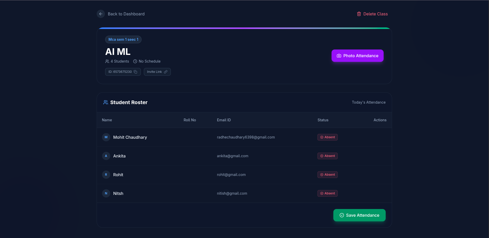
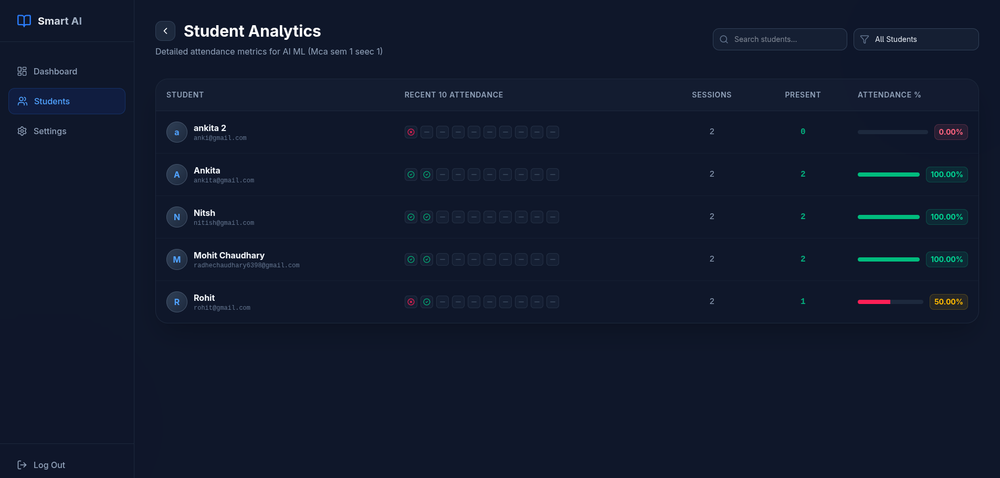

# Attendance.Ai

An AI-powered smart attendance management system built to automate student attendance tracking using modern web technologies and intelligent processing.

## 🚀 Features

- 👨‍🎓 Student Management
- 🏫 Class & Subject Management
- ✅ Smart Attendance Tracking
- 📊 Attendance Analytics Dashboard
- 📅 Daily Attendance Records
- 📈 Attendance Percentage Calculation
- 🔍 Recent Attendance History
- 🌐 Responsive UI
- ⚡ Real-time Updates
- 🔐 Authentication & Authorization
- 🤖 AI-based attendance workflow support

---

## 🛠️ Tech Stack

### Frontend
- React.js
- Tailwind CSS
- Axios
- React Router

### Backend
- Node.js
- Express.js
- flask (model deployment as a microservice)
- numpy 
- face_recognition


### Database
- PostgreSQL

### Getting Started
```bash
git clone https://github.com/radhechaudhary/smart_ai_attendance.git
cd AttendanceManager

# Install backend dependencies
cd backend
npm install

# Start backend
create .env file and add the following lines:
DB_PASSWORD = "PASSWORD"
DB_PORT = PORT
DB_HOST = "HOST"
DB_USER = "NAME" 
DB_NAME = "DB_NAME"
SECRET_KEY = "SECRET KEY"


npm run dev

# Install frontend dependencies
cd ../frontend
npm install

# Start frontend
npm run dev

# Start Model

cd model
pip install -r requirements.txt

gunicorn --workers 4 --bind 0.0.0.0:5001 app:app

```


### Screenshots






---

## 📂 Project Structure

```bash
smart_ai_attendance_system/
│
├── frontend/        # Frontend React App
├── backend/          # Backend API
├── database/        # SQL schema & queries
├── public/
├── README.md
└── package.json