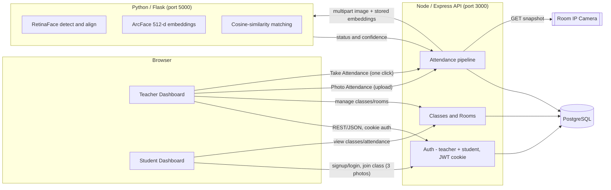
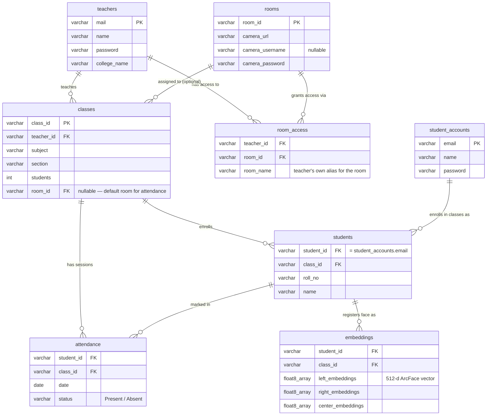
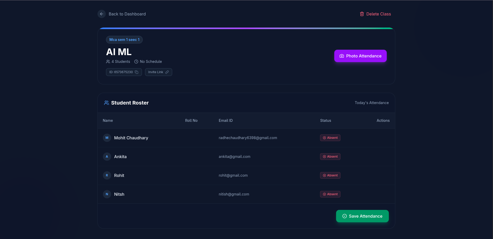
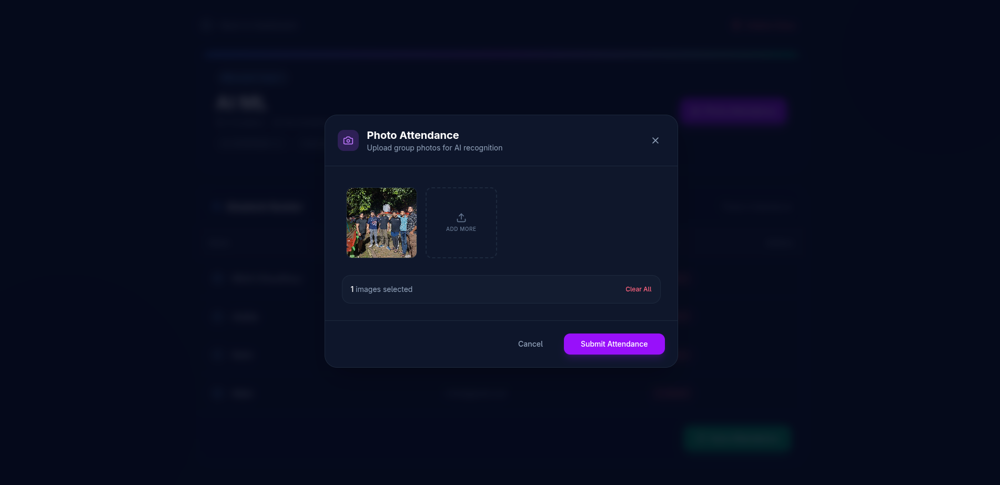
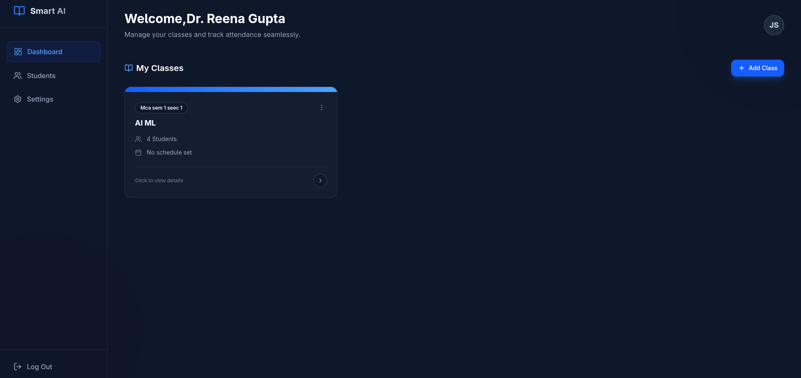
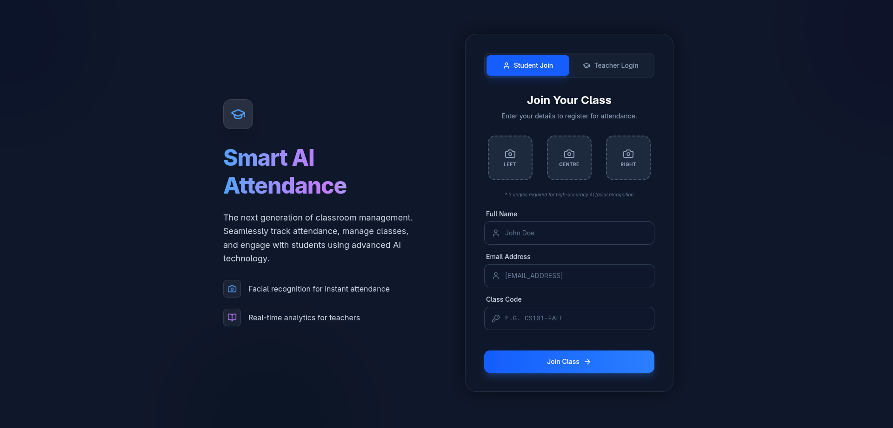
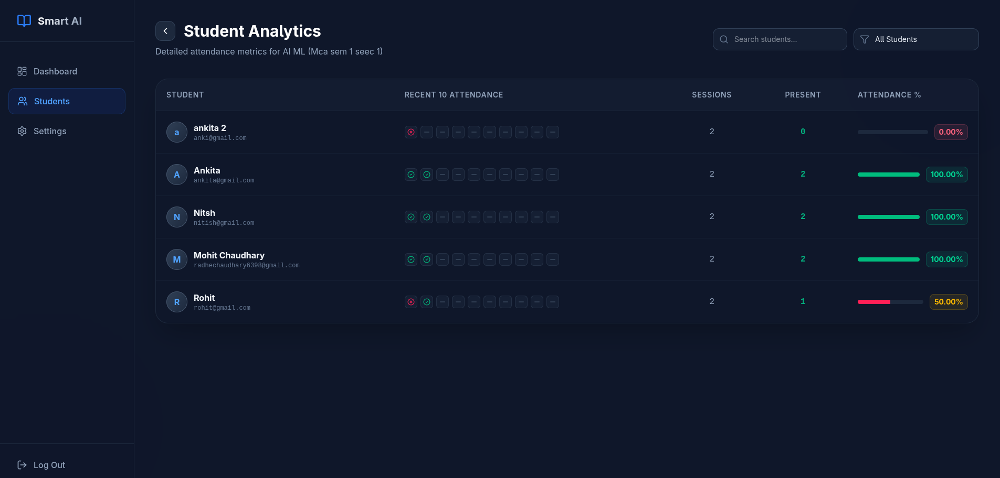

# 🎓 Attendance.Ai

**AI-powered classroom attendance.** Students register their face once; teachers mark attendance in seconds instead of calling out a roll list — either by snapping a classroom photo themselves, or automatically from a camera already mounted in the room.

This README explains how the pieces fit together, what happens on each request, and how to run the whole stack locally.

---

## Table of Contents

- [Overview](#overview)
- [Architecture](#architecture)
- [Tech Stack](#tech-stack)
- [Repository Structure](#repository-structure)
- [Data Model](#data-model)
- [Core Flows](#core-flows)
- [API Reference](#api-reference)
- [Getting Started](#getting-started)
- [Running Services Individually (without Docker)](#running-services-individually-without-docker)
- [Environment Variables](#environment-variables)
- [Known Limitations](#known-limitations)
- [Screenshots](#screenshots)
- [Contributing](#contributing)
- [License](#license)

---

## Overview

Attendance.Ai is a small microservice system with four moving parts:

1. A **React frontend** — separate dashboards for teachers and students.
2. A **Node/Express backend** — auth, class/room management, and the attendance pipeline, backed by Postgres.
3. A **Python/Flask model service** — face detection + recognition (InsightFace / ArcFace), stateless, called by the backend over HTTP.
4. **Postgres** — the single source of truth for users, classes, embeddings, and attendance records.

Attendance can be marked two ways:
- **Manually** — a teacher uploads or snaps a classroom photo on demand ("Photo Attendance").
- **Automatically** — a teacher registers a room's camera once (its snapshot URL + a password), assigns that room to a class, and from then on clicking "Take Attendance" has the *backend* pull a fresh snapshot from the camera itself — no photo-taking by the teacher at all.

Both paths end up at the same place: the model service compares faces in the photo against each enrolled student's stored face embeddings and the backend writes `Present`/`Absent` rows into `attendance`.

---

## Architecture


```mermaid
flowchart LR
    subgraph Client["Browser"]
        TFE["Teacher Dashboard"]
        SFE["Student Dashboard"]
    end

    subgraph Backend["Node / Express API (port 3000)"]
        AUTH["Auth - teacher + student, JWT cookie"]
        CLASS["Classes and Rooms"]
        ATT["Attendance pipeline"]
    end

    subgraph ModelSvc["Python / Flask (port 5000)"]
        DET["RetinaFace detect and align"]
        ENC["ArcFace 512-d embeddings"]
        MATCH["Cosine-similarity matching"]
    end

    DB[("PostgreSQL")]
    CAM[["Room IP Camera"]]

    TFE -- "REST/JSON, cookie auth" --> AUTH
    TFE -- "manage classes/rooms" --> CLASS
    TFE -- "Photo Attendance (upload)" --> ATT
    TFE -- "Take Attendance (one click)" --> ATT
    SFE -- "signup/login, join class (3 photos)" --> AUTH
    SFE -- "view classes/attendance" --> CLASS

    AUTH --> DB
    CLASS --> DB
    ATT --> DB
    ATT -- "multipart image + stored embeddings" --> ModelSvc
    ATT -- "GET snapshot" --> CAM
    ModelSvc -- "status and confidence" --> ATT
```

**Why a separate model service?** Face recognition needs a heavy native/GPU stack (OpenCV, ONNX Runtime, InsightFace's RetinaFace + ArcFace model pack) that has nothing to do with the web app's request/response cycle. Keeping it as its own stateless HTTP service means the Node backend never touches ML dependencies — it just forwards image bytes and gets back `{status, confidence}` per student.

---

## Tech Stack

| Layer         | Technology |
|---------------|------------|
| Frontend      | React 19, Vite, Tailwind CSS v4, React Router, Zustand, Framer Motion, Axios |
| Backend       | Node.js, Express 5, `pg`, `node-pg-migrate`, JWT (`jsonwebtoken`), `bcrypt`, `multer` |
| AI Model      | Python, Flask, **InsightFace (RetinaFace detection + ArcFace recognition, 512-d embeddings)**, OpenCV, ONNX Runtime (GPU with CPU fallback) |
| Database      | PostgreSQL 17 |
| Mobile        | Tauri + React (companion app in `mobile-app/`, mirrors the frontend) |
| Orchestration | Docker Compose |

> The model service was upgraded from an earlier dlib/`face_recognition` (128-d) implementation to InsightFace/ArcFace (512-d, GPU-capable, better lighting robustness via CLAHE preprocessing). If you're on an older checkout, `backend/migrations/1787654912000_clear-embeddings-for-arcface.js` clears old incompatible embeddings — everyone re-registers once after that migration runs.

---

## Repository Structure

```
Attendance.Ai/
├── frontend/                    # React + Vite app (teacher + student UIs)
│   └── src/
│       ├── pages/                # dashboard.jsx, ClassDetails, Rooms, Students,
│       │                         # StudentDashboard, StudentClassDetails, Login, Signup, Landing
│       ├── components/           # Sidebar, JoinClassModal, PhotoAttendanceModal, ThemeToggle
│       └── store/                # zustand stores: userStore, classesStore, roomsStore,
│                                  # studentClassesStore, themeStore
├── backend/                     # Node/Express REST API
│   ├── controllers/              # one file per concern (auth, class, room, student…)
│   ├── routes/                   # user.route, class.route, room.route, student.route
│   ├── middleware/                # verifyToken (JWT), requireRole (teacher/student gate)
│   ├── database/                  # pg Pool setup
│   └── migrations/                # node-pg-migrate migrations (schema history)
├── model/                        # Python/Flask face-recognition microservice
│   └── app.py                     # /generate_embeddings, /match_embeddings
├── mobile-app/                   # Tauri desktop/mobile shell around a copy of the frontend
├── docker-compose.yaml           # wires frontend + backend + model + postgres together
└── project_SS/                   # README screenshots
```

---

## Data Model


```mermaid
erDiagram
    teachers ||--o{ classes : "teaches"
    teachers ||--o{ room_access : "has access to"
    rooms ||--o{ room_access : "grants access via"
    rooms ||--o{ classes : "assigned to (optional)"
    classes ||--o{ students : "enrolls"
    student_accounts ||--o{ students : "enrolls in classes as"
    classes ||--o{ attendance : "has sessions"
    students ||--o{ attendance : "marked in"
    students ||--o{ embeddings : "registers face as"

    teachers {
        varchar mail PK
        varchar name
        varchar password
        varchar college_name
    }
    student_accounts {
        varchar email PK
        varchar name
        varchar password
    }
    classes {
        varchar class_id PK
        varchar teacher_id FK
        varchar subject
        varchar section
        int students
        varchar room_id FK "nullable — default room for attendance"
    }
    students {
        varchar student_id FK "= student_accounts.email"
        varchar class_id FK
        varchar roll_no
        varchar name
    }
    embeddings {
        varchar student_id FK
        varchar class_id FK
        float8_array left_embeddings "512-d ArcFace vector"
        float8_array right_embeddings
        float8_array center_embeddings
    }
    attendance {
        varchar student_id FK
        varchar class_id FK
        date date
        varchar status "Present / Absent"
    }
    rooms {
        varchar room_id PK
        varchar camera_url
        varchar camera_username "nullable"
        varchar camera_password
    }
    room_access {
        varchar teacher_id FK
        varchar room_id FK
        varchar room_name "teacher's own alias for the room"
    }
```

A few things worth calling out about this schema:
- `students` uses a **composite key** `(student_id, class_id)` — the same person (same `student_accounts.email`) can be enrolled in many classes, each with its own roll number and face embeddings.
- **Rooms are shared, not owned.** A `rooms` row (camera URL + password) isn't tied to one teacher. A teacher gains access by entering the room's ID and password once; that grant — plus the alias they chose for it — lives in `room_access`. Deleting a `room_access` row only revokes *that teacher's* access; the room itself is untouched.
- `classes.room_id` is the class's **default room** — set once via the room dropdown on the class page (or the inline "+ Add a Room" flow), it's remembered for every future "Take Attendance" click.

---

## Core Flows

### 1. Teacher: create a class and mark attendance manually
1. Sign up / log in (`POST /user/teacher-signup` or `/teacher-login`) — a JWT is set as a cookie.
2. Create a class (`POST /classes/addClass`) — gets a random 10-digit `class_id`, shareable as an invite link (`/login?tab=student&classId=...`).
3. Share the invite link or class code with students.
4. On class day, open the class → **Photo Attendance** → upload/capture a classroom photo.
5. Backend (`photoAttendance`) sends the photo + every enrolled student's stored embeddings to the model service's `/match_embeddings`, gets back `{status, confidence}` per matched student, and the teacher reviews/adjusts the roster before **Save Attendance** writes it to the `attendance` table.

### 2. Teacher: automatic attendance via a room camera
1. **Add a room** (Rooms page, or inline on a class page): enter the Room ID + password given for that camera, and pick your own alias for it. This calls `POST /rooms/addRoomTeacher`, which checks the password against `rooms.camera_password` and inserts a `room_access` row.
2. **Assign the room to a class** — picking it from the dropdown calls `POST /classes/assignRoom` (rejected with 403 if you haven't added that room) and persists it as the class's default.
3. Click **Take Attendance** — no photo picker, no camera preview. The backend (`autoCaptureAttendance`) does everything:
   - looks up the class's room and its camera credentials,
   - `GET`s a fresh snapshot straight from `camera_url` (HTTP Basic Auth if the camera needs it),
   - forwards that snapshot + the class's stored embeddings to `/match_embeddings`,
   - writes `Present`/`Absent` for every enrolled student immediately (no separate "save" step).
4. The roster and success/error banner update in place; a teacher can still hand-correct any row afterward.

### 3. Student: register and check attendance
1. Sign up / log in (`POST /user/student-signup` / `/student-login`) — this is a separate identity from a class enrollment, so one account can join many classes.
2. **Join a class**: enter the class code + 3 face photos (left/right/center). Backend (`joinClass`) sends them to `/generate_embeddings`, which runs blur/face-size/lighting checks before returning 3 embedding vectors, then enrolls the student and stores those embeddings.
3. From the student dashboard, view every joined class as a card with a live attendance percentage; opening a class shows the full present/absent history.

---

## API Reference

All routes are JSON (except file uploads, which are `multipart/form-data`) and rely on the `authToken` cookie set at login. `requireRole` gates teacher-only vs student-only routes; a request with the wrong role gets a `403`.

| Method | Route | Role | Purpose |
|--------|-------|------|---------|
| POST | `/user/teacher-signup` | — | Create a teacher account |
| POST | `/user/teacher-login` | — | Teacher login |
| POST | `/user/student-signup` | — | Create a student account |
| POST | `/user/student-login` | — | Student login |
| POST | `/user/auth` | any | Verify the current session, returns `{role, name, email}` |
| POST | `/user/join_class` | student | Join a class with 3 face photos |
| POST | `/user/logout` | any | Clear the auth cookie |
| POST | `/classes/addClass` | teacher | Create a class |
| GET  | `/classes/fetchClassesList` | teacher | List the teacher's classes (+ assigned room) |
| POST | `/classes/getStudents` | teacher | Roster for one class |
| POST | `/classes/photoAttendance` | teacher | Manual attendance: match an uploaded photo |
| POST | `/classes/markAttendance` | teacher | Persist reviewed attendance statuses |
| POST | `/classes/getClassStudentStats` | teacher | Per-student attendance history/percentage |
| POST | `/classes/assignRoom` | teacher | Set/clear a class's default room |
| POST | `/classes/autoCaptureAttendance` | teacher | Capture from the assigned room's camera and mark attendance |
| POST | `/rooms/addRoomTeacher` | teacher | Claim a room by ID + password, with an alias |
| GET  | `/rooms/fetchRoomsListTeacher` | teacher | List rooms this teacher has added |
| POST | `/rooms/deleteRoomTeacher` | teacher | Remove a room from this teacher's list |
| GET  | `/student/fetchClassesList` | student | List joined classes with attendance % |
| POST | `/student/getClassDetails` | student | One class's full attendance history |

Model service (called only by the backend, not the frontend):

| Method | Route | Purpose |
|--------|-------|---------|
| POST | `/generate_embeddings` | 3 registration photos → 3× 512-d ArcFace embeddings |
| POST | `/match_embeddings` | classroom photo(s) + stored embeddings → `{status, confidence}` per matched student |

---

## Getting Started

### Prerequisites

- [Docker](https://docs.docker.com/get-docker/) + Docker Compose
- An NVIDIA GPU + [NVIDIA Container Toolkit](https://docs.nvidia.com/datacenter/cloud-native/container-toolkit/latest/install-guide.html) is **optional** — the model service falls back to CPU (`onnxruntime`'s `CPUExecutionProvider`) automatically if no GPU is available; it's just slower.

### Run everything with Docker Compose

```bash
git clone https://github.com/radhechaudhary/smart_ai_attendance.git
cd Attendance.Ai
docker compose up --build
```

This starts, in order: `postgres` → `migration` (runs every pending `node-pg-migrate` migration once, then exits) → `backend` → `model` → `frontend`.

| Service    | URL                     |
|------------|-------------------------|
| Frontend   | http://localhost:5173   |
| Backend    | http://localhost:3000   |
| Model API  | http://localhost:5000   |
| Postgres   | localhost:5433 (mapped from the container's 5432) |

First-time setup: open the frontend, sign up as a teacher, create a class, and share its invite link with a student account to try the face-registration flow. For the room-camera flow, a room's `camera_url`/`camera_password` row currently has to be inserted directly into the `rooms` table (there's no teacher-facing "provision a new camera" UI by design — see [Known Limitations](#known-limitations)); a teacher then claims it through the app with that ID and password.

To re-run just the database migrations after pulling new changes:

```bash
docker compose run --rm migration
```

To stop everything:

```bash
docker compose down          # keep the Postgres volume (your data)
docker compose down -v       # also wipe the Postgres volume
```

---

## Running Services Individually (without Docker)

Useful for fast iteration on one service at a time. Postgres still needs to be running somewhere reachable (Docker is the easiest way to get just that: `docker compose up -d postgres`).

**Backend**
```bash
cd backend
npm install
# set DB_HOST, DB_PORT, DB_USER, DB_PASSWORD, DB_NAME, SECRET_KEY, MODEL_API_URL (see below)
npm run migrate up   # apply migrations
npm run dev           # nodemon, http://localhost:3000
```

**Frontend**
```bash
cd frontend
npm install
VITE_API_URL=http://localhost:3000 npm run dev   # http://localhost:5173 (or next free port)
```

**Model service**
```bash
cd model
python3 -m venv venv && source venv/bin/activate
pip install -r requirements.txt
python app.py   # http://localhost:5000
```

---

## Environment Variables

| Variable | Used by | Description |
|----------|---------|-------------|
| `DB_HOST`, `DB_PORT`, `DB_USER`, `DB_PASSWORD`, `DB_NAME` | backend | Postgres connection (via `pg.Pool`) |
| `DATABASE_URL` | migration | Connection string for `node-pg-migrate` (docker-compose's `migration` service) |
| `SECRET_KEY` | backend | JWT signing secret |
| `MODEL_API_URL` | backend | Base URL of the model service, e.g. `http://model:5000` |
| `VITE_API_URL` | frontend | Base URL of the backend API (only read by the teacher-login form today — most other requests hardcode `http://localhost:3000`, worth normalizing if you touch that file) |

None of these are checked into the repo (`docker-compose.yaml` inlines dev-only defaults) — for anything beyond local development, move them into `.env` files that stay out of version control.

---

## Known Limitations

Being upfront about a few tradeoffs already made in this codebase, so they don't surprise anyone:

- **Camera credentials are stored in plain text** (`rooms.camera_password`), not hashed — it has to double as the literal HTTP Basic-Auth password sent to the physical camera, which rules out one-way hashing. Consistent with the rest of the app's security posture (see next point), but worth knowing since it's a real device credential.
- **The auth cookie is not `httpOnly`** and is signed but not encrypted — acceptable for a project at this stage, not something to carry into a production deployment as-is.
- **No admin UI for provisioning cameras.** A `rooms` row (camera URL + password) is currently expected to be inserted directly into the database by whoever installs the camera — mirroring how a school's IT staff would configure the hardware itself. Teachers only ever *claim* access to an already-provisioned room.
- **Roll numbers aren't collected at join time** — `join_class.controller.js` currently hardcodes a placeholder roll number for every new enrollment.

---

## Screenshots







---

## Contributing

1. Fork the repository
2. Create a feature branch: `git checkout -b feature/your-feature`
3. Commit your changes: `git commit -m 'feat: add your feature'`
4. Push to your branch: `git push origin feature/your-feature`
5. Open a Pull Request

---

## License

This project is open source under the MIT License.
